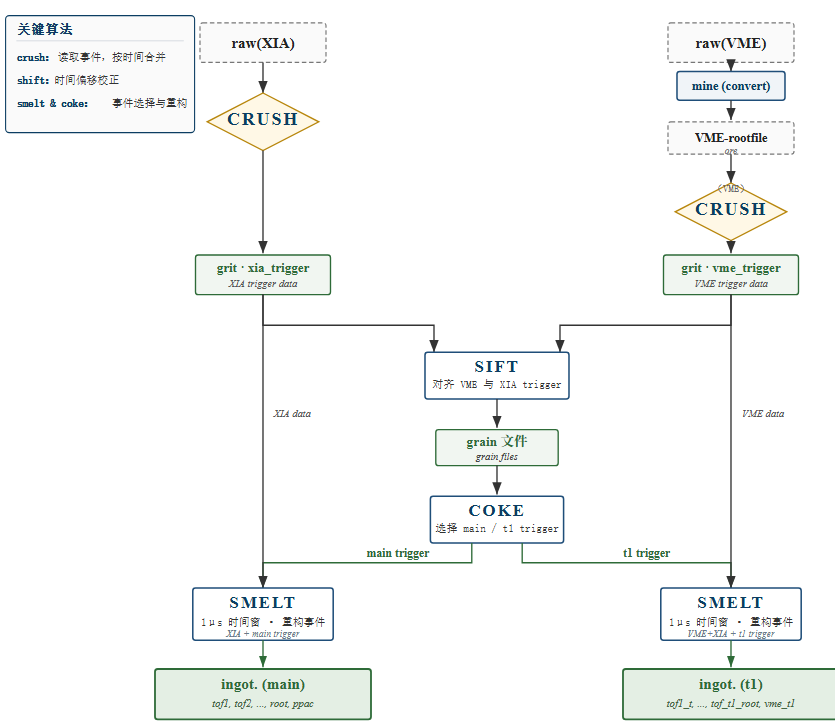
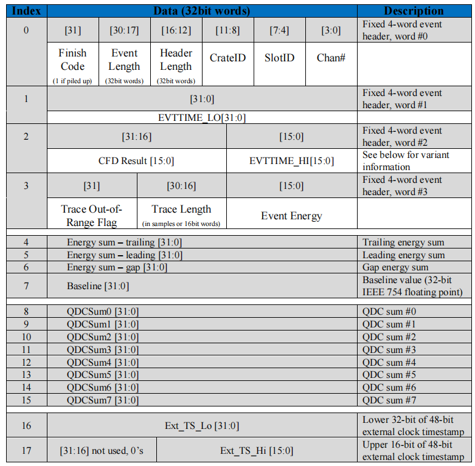
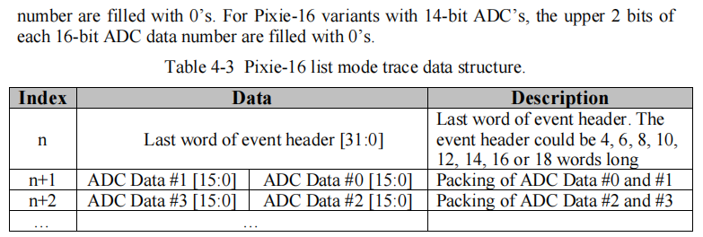
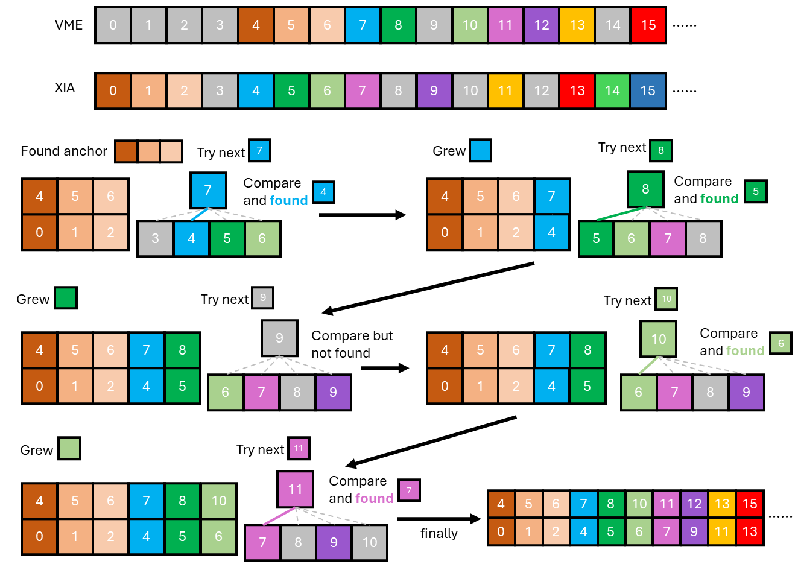

# 数据预处理 （forgerib）


forgerib 用于预处理实验数据，包含以下功能：

- 数据解码 （crush）：解码XIA获取的数据，在解码的同时拆分，映射到对应的探测器。同时拆分映射VME探测器。
- XIA和VME的时间对齐 （sift）：得到对应事件的Entry数
- 提取触发 （coke）
- 利用对应的触发，重建事件。



## 数据解码 （crush）

XIA 中的事件是紧凑排列的，每个事件是独立的，都以固定的 4*4 字节(byte)开头，作为事件头。事件头中包含了机箱、插件、通道用于定位硬件位置，也包含了触发信号的能量、时间等物理信息，以及头部长度、事件长度等结构信息.




需要注意的是本次实验中有一些损坏的插件，可能会一些带有瑕疵的二进制数据，目前发现主要有两种形式：

1. 事件头部的第 2 字节、第 10 字节的最高位被置为 1。
    - 第 2 字节的最高位是描述事件头部长度的一部分，目前主要观察到的是本来是长度是 4 的置位后变成 12，和事件长度、波形长度不自洽（正常来说，事件长度=波形长度/2+头部长度），所以会观察到波形长度位 0，头部长度为 12，事件长度为 4 的事件。目前的处理方法是发现波形长度为 0，头部长度为 12，事件长度为 4 的事件，直接将头部长度修正为 4。
    - 第 10 字节是描述时间戳高位的，最高位为 1 需要十几天才能达到，出现在本次实验中必然是错误的。目前的解决方法是发现时间戳最高位为 1 就置为 0。
2. 一个事件后紧跟着一个字节的 0. 目前解决方法是跳过一个字节。

## XIA和VME的时间对齐 （sift）

!!! note

    本次实验中，使用XIA的逻辑插件输出`10MHz`的时钟信号接入VME的v830插件，用于两系统之间的对齐。


由于XIA中直接记录了VME的trigger,同时VME的trigger进行了busy保护，在理论上可以实现VME事件和XIA记录的VME-trigger一一对应。
实际上XIA和VME都会偶尔丢失事件，尤其是VME获取在计数率比较高的时候。
绝大部分的事件都是有对应的，VME计数率低于500的时候是99%，接近1000的时候为90%以上，所以我们可以从大部分好的事件上做文章。
另一方面，对应的事件之间的时间差总是在极小的窗口内。比如说事件 A 和事件 B 在两边都有记录，那么 XIA 中 A、B 的时间差，于 VME 中 A、B 的时间差应该是非常
接近的（实验前测试结果在50*100ns以内），分析代码中
认为在时间差 10000 ns 以内都算是对应事件。



上图给出了对齐的大致流程，为了方便叙述，这里定义 VME 中事件 $i$ 和事件 $j$ 的时间差为 $t_{i, j}^v$，XIA 中的事件 $i$ 和 事件 $j$ 的时间差为 $t_{i,j}^x$。

+ 找到两套获取系统中的锚点，即连续三个事件一一对应，或者说三个事件之间的时间差一一对应。以上图为例，即满足 $t^v_{4,5} = t^x_{0,1}$ 且 $t^v_{5,6} = t^x_{1,2}$;
+ 找到锚点后，尝试 VME 下一个事件，寻找 XIA 中时间差接近的。以上图为例：
  + 尝试 VME 事件 7，计算 $t^v_{6,7}$；
  + XIA 中计算 $t^x_{2,3}$ 到 $t^x_{2,6}$；
  + 对比发现 $t^v_{6,7} \approx t^x_{2,4}$，认为 VME 事件 7 和 XIA 事件 4 是同一个事件；
  + 图示仅对比了 XIA 中 4 个事件，实际对比 **10** 个事件；
+ 如果下一个 VME 事件在若干个（实际是 10 个）XIA 事件中没有对应的，舍弃这个 VME 事件，尝试下一个事件。以上图为例，VME 事件 9 没有对应的事件，舍弃后尝试事件 10，发现有对应的，记录并尝试下一个 VME 事件；
+ 如果连续多个 VME 事件都找不到对应的 XIA 事件（系统遇到某种跳变），回到第一步，重新寻找锚点。

实际效果(由于VME启动后就会有vme_trigger，vme事件数通常大于xia事件数)：

```
    VXIA align rate 189007 / 189018 0.999942
    VME align rate 189007 / 190629 0.991491
```

经过以上步骤，得到了一个 VME 和 XIA 事件的对照表（对应是事件的Entry序号），此表保存在 `grain` 目录下，以供后续重组事件使用。


## 提取触发 （coke）

分析发现，实验中的XIA记录的main_trigger的通道效率，由于该插件的体质原因只有90%左右。
但是丢失的10%其实已经被记录下来了，如果之间使用main_trigger重建事件，就会之间损失10%的事件。
以run-60为参考进行统计：

| XIA主trigger数 | vme和XIA对齐事件数（不卡vme阈值） |  vme和XIA对齐事件数（不卡vme阈值），同时要求XIA有主trigger    |  ppac0阳极事件数 |
| ---------------- | ---------------- | ---------------- | ---------------- |
| 26426630 | 189007 |  172845 | 28916352 |

同时以注意到 $26426630/28916352 = 0.914$，$172845/189007 = 0.914$，说明记录main_trigger的通道效率为91.4%, 很大程度上低于PPAC插件的通道效率。

使用ppac0阳极事件数作为主触发，重建事件：

|ppac0阳极事件数 | vme和XIA对齐事件数（不卡vme阈值） |  vme和XIA对齐事件数（不卡vme阈值），同时要求XIA有ppac0阳极触发    | XIA主trigger数，同时要求XIA有ppac0阳极触发    |
| ---------------- | ---------------- | ---------------- |  - |
| 28916352 | 189007 | 111756 | 25666122 |

此时vme事件数大大降低，这也可以理解，这是由于vme中有很多噪声触发，并没有束流信号。

**因此需要对比卡vme阈值之后的效果，目前卡vme阈值之后，vme和xia对齐的事件数变为118439**

使用ppac0阳极事件数作为主触发，重建事件：

|ppac0阳极事件数 | vme和XIA对齐事件数（卡vme阈值） |  vme和XIA对齐事件数（卡vme阈值），同时要求XIA有ppac0阳极触发    | XIA主trigger数，同时要求XIA有ppac0阳极触发    |
| ---------------- | ---------------- | ---------------- |  - |
| 28916352 | 118439 | 77894 | 25666122 |


使用main_trigger作为主触发，重建事件：

|main_trigger事件数 | vme和XIA对齐事件数（卡vme阈值） |  vme和XIA对齐事件数（卡vme阈值），同时要求XIA有main_trigger触发    | ppac0阳极事件数，同时要求XIA有main_trigger触发    |
| ---------------- | ---------------- | ---------------- |  - |
| 26426630 | 118439 | 107872 | 25666122 |


## 组装触发事件 （smelt）

根据decode 数据，初步设置提取hit结构时的阈值，同时根据初步pid拟合的系数判断最低阈值：

|  layer |  正面阈值 |  背面阈值 | 参考阈值/(MeV) |
| -------| --------| --------| ----------------|
| t0d1 | 150 | 450 | 0.21 |
| t0d2 | 200 | 200 | 2.00 |
| t0d3 | 150 | 150 | 1.36 |
| t0d4 | 50 | 50 | 1.20 |
| t0s | 100 | 100 | 100 |


